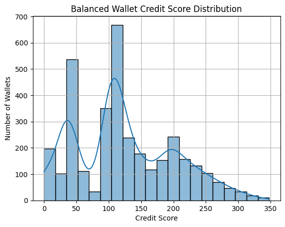
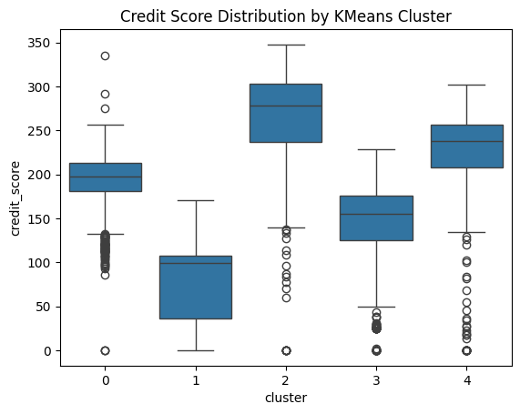

# Wallet Score Analysis

This report provides behavioral insights based on scored DeFi wallets interacting with Aave V2.

---

## 🔢 Score Distribution

- The majority of wallets scored between **50 and 300**
- High score concentration indicates responsible or repetitive behavior
- Few extreme outliers (near-zero or over-300)

 
---

## 🧠 Behavioral Segments

### 🎯 High-Score Wallets (200+)
- Consistent deposits and full repayments
- Many unique tokens and frequent interactions
- Zero liquidation events
- Long wallet lifespan

### ⚠️ Low-Score Wallets (Below 100)
- Borrowed but never repaid
- Redeemed little to no deposited funds
- Experienced liquidation
- One-off or inactive behavior

---

## 📊 KMeans Cluster Analysis

| Cluster | Traits                                      | Avg Score |
|---------|---------------------------------------------|-----------|
| 2       | High depositors, active, multi-token users  | High      |
| 0       | Steady usage, some liquidation              | Mid       |
| 1, 3    | Inactive or low-volume borrowers            | Low       |
| 4       | Moderate users, no anomalies                | Mid-High  |

 
---

## 🧪 Anomalies

~1% of wallets were flagged as anomalies:
- Either extremely frequent or rare activity
- Penalized by 50% in final score to prevent misclassification

---

## 💡 Conclusion

This scoring model provides a strong behavioral signal for DeFi wallet reliability. It is transparent, explainable, and extensible for production use.

